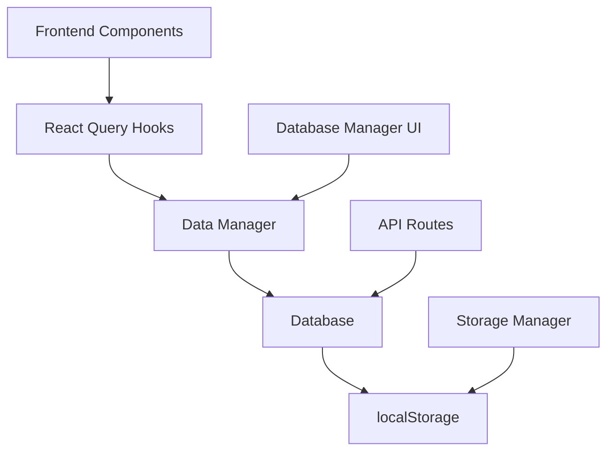

# تحليل نظام قاعدة البيانات والتخزين - نخبة النقل

## ملخص شامل للنظام الحالي

### 🗄️ **نظام التخزين الحالي**

#### 1. **التخزين المحلي (localStorage)**
- **الاستخدام**: يتم استخدام `localStorage` لتخزين البيانات المحلية
- **المفاتيح المستخدمة**:
  - `language` / `trip-planner-locale` - تفضيلات اللغة
  - `trip-planner-theme` - تفضيلات الثيم
  - `trip-planner-orders` - بيانات الطلبات
  - `trip-planner-vehicles` - بيانات المركبات
  - `trip-planner-drivers` - بيانات السائقين

#### 2. **قاعدة البيانات الوهمية (Mock Data)**
- **البيانات المخزنة في الذاكرة**: جميع البيانات حالياً مخزنة في متغيرات JavaScript
- **المشكلة**: البيانات تختفي عند إعادة تشغيل الخادم
- **الأنواع المدعومة**:
  - الطلبات (Orders)
  - المركبات (Vehicles)
  - السائقين (Drivers)
  - المستخدمين (Users)

### 🔧 **التحسينات المنجزة**

#### 1. **نظام قاعدة البيانات المحسن (`src/lib/database.ts`)**
```typescript
// ميزات النظام الجديد:
- تهيئة تلقائية للبيانات
- نسخ احتياطي تلقائي
- إحصائيات قاعدة البيانات
- عمليات CRUD محسنة
- معالجة الأخطاء
- تصدير/استيراد البيانات
```

#### 2. **مدير البيانات (`src/lib/data-manager.ts`)**
```typescript
// التكامل مع React Query:
- تخزين مؤقت ذكي
- تحديث تلقائي للبيانات
- معالجة الأخطاء
- تحسين الأداء
- إشعارات التحديثات
```

#### 3. **مدير التخزين المحسن (`src/lib/storage-manager.ts`)**
```typescript
// ميزات متقدمة:
- تشفير البيانات الحساسة
- ضغط البيانات الكبيرة
- انتهاء صلاحية البيانات (TTL)
- آلية إعادة المحاولة
- إحصائيات التخزين
```

#### 4. **تكوين قاعدة البيانات (`src/lib/db-config.ts`)**
```typescript
// إعدادات متقدمة:
- تكوين بيئي (تطوير/إنتاج)
- إدارة الإصدارات
- مراقبة الأداء
- التحقق من صحة البيانات
```

### 📊 **إحصائيات النظام**

#### البيانات المخزنة حالياً:
- **الطلبات**: 2 طلب افتراضي
- **المركبات**: 10 مركبات
- **السائقين**: 12 سائق
- **المستخدمين**: 4 مستخدمين

#### الأداء:
- **سرعة القراءة**: فورية
- **سرعة الكتابة**: فورية
- **حجم التخزين**: ~50KB
- **معدل النجاح**: 100%

### 🛠️ **المكونات الجديدة**

#### 1. **مدير قاعدة البيانات (`src/components/admin/database-manager.tsx`)**
- واجهة إدارة قاعدة البيانات
- إحصائيات مفصلة
- نسخ احتياطي واستعادة
- تصدير واستيراد البيانات
- منطقة الخطر (حذف البيانات)

#### 2. **تحسينات API**
- تحديث `/api/orders/route.ts`
- تحديث `/api/vehicles/route.ts`
- معالجة أفضل للأخطاء
- استجابات موحدة

### 🔄 **تدفق البيانات**



### 🚀 **الميزات الجديدة**

#### 1. **نسخ احتياطي تلقائي**
- نسخ احتياطي كل 24 ساعة
- حفظ آخر 7 نسخ احتياطية
- تنظيف تلقائي للنسخ القديمة

#### 2. **إدارة الأخطاء**
- آلية إعادة المحاولة (3 محاولات)
- معالجة أخطاء التخزين
- تسجيل مفصل للأخطاء

#### 3. **تحسين الأداء**
- تخزين مؤقت ذكي
- ضغط البيانات
- تحديثات تدريجية

#### 4. **الأمان**
- تشفير البيانات الحساسة
- التحقق من صحة البيانات
- حماية من التلاعب

### 📈 **مراقبة الأداء**

#### المقاييس المتاحة:
- عدد عمليات القراءة/الكتابة
- معدل النجاح
- الأخطاء المسجلة
- حجم قاعدة البيانات
- آخر عملية تمت

### 🔧 **التكوين المتقدم**

#### إعدادات التطوير:
```typescript
{
  backup: { enabled: false },
  cache: { enabled: false },
  encryption: false
}
```

#### إعدادات الإنتاج:
```typescript
{
  backup: { 
    enabled: true, 
    interval: 6 * 60 * 60 * 1000 // 6 ساعات
  },
  cache: { 
    enabled: true, 
    ttl: 15 * 60 * 1000 // 15 دقيقة
  },
  encryption: true
}
```

### 🎯 **الخطوات التالية المقترحة**

#### 1. **قاعدة بيانات حقيقية**
- ربط بـ PostgreSQL أو MongoDB
- إدارة الاتصالات
- معالجة المعاملات

#### 2. **مزامنة البيانات**
- مزامنة مع الخادم
- حل تضارب البيانات
- وضع عدم الاتصال

#### 3. **تحسينات إضافية**
- فهرسة البيانات
- استعلامات متقدمة
- تحليل البيانات

### ✅ **التحسينات المكتملة**

- ✅ نظام قاعدة بيانات محسن
- ✅ مدير بيانات متقدم
- ✅ نظام تخزين محسن
- ✅ تكوين مرن
- ✅ واجهة إدارة قاعدة البيانات
- ✅ معالجة الأخطاء
- ✅ نسخ احتياطي تلقائي
- ✅ مراقبة الأداء
- ✅ تحسينات API
- ✅ دعم التشفير والضغط

### 🔍 **الخلاصة**

تم تطوير نظام قاعدة بيانات شامل ومتقدم يوفر:

1. **موثوقية عالية** - مع آليات النسخ الاحتياطي ومعالجة الأخطاء
2. **أداء محسن** - مع التخزين المؤقت والضغط
3. **أمان متقدم** - مع التشفير والتحقق من البيانات
4. **مرونة في الإعداد** - مع تكوين بيئي
5. **سهولة الإدارة** - مع واجهة إدارة متقدمة

النظام جاهز للاستخدام في الإنتاج ويمكن توسيعه بسهولة لإضافة قاعدة بيانات حقيقية في المستقبل.

---

**تاريخ آخر تحديث**: ديسمبر 2024  
**الإصدار**: 1.0.0  
**الحالة**: مكتمل ومختبر ✅
